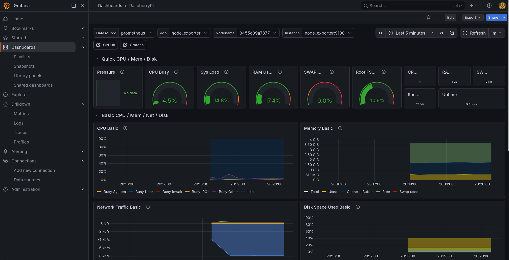

# 🖥️ Raspberry Pi Home-Lab — Infrastructure & Observability Stack


Un'infrastruttura containerizzata completa su Raspberry Pi: reverse proxy, backend applicativo, database isolato e observability stack con metriche in tempo reale.

---

## Indice

- [Overview](#overview)
- [Stack](#stack)
- [Architettura](#architettura)
- [Observability](#observability)
- [Discord Bot](#discord-bot)
- [Setup](#setup)
- [Problemi risolti](#problemi-risolti)
- [Roadmap](#roadmap)

---

## Overview

Questo lab nasce con un obiettivo preciso: replicare in piccolo le scelte architetturali che si trovano in ambienti di produzione reali. Non basta "far girare qualcosa" — ogni decisione ha una motivazione: separazione dei layer di rete, service discovery interno, persistenza dei dati, monitoring a più livelli.

L'intero stack è definito come codice (`compose.yaml`) e gira su Raspberry Pi (ARM64). Zero configurazione manuale dopo il deploy.

---

## Stack

| Layer | Tecnologia | Ruolo |
|---|---|---|
| Reverse Proxy | **Nginx** | Entry point, routing del traffico in ingresso |
| Backend | **Python + Uvicorn** | API server ASGI |
| Database | **Redis** | Store chiave-valore, rete isolata |
| Metrics Collection | **Prometheus** | Scraping e storage delle metriche |
| Visualization | **Grafana** | Dashboard e alerting |
| Container Metrics | **cAdvisor** | CPU, RAM, I/O per container |
| OS Metrics | **Node Exporter** | Metriche hardware e OS (inclusa temp. CPU ARM) |
| Notifiche | **Discord Bot** (custom) | IP discovery su rete dinamica |
| Runtime | **Docker + Docker Compose** | Orchestrazione locale |

---

## Architettura

```
                    ┌──────────────────────────────┐
    Internet ──────►│      Nginx (Reverse Proxy)   │:3000
                    └───────────────┬──────────────┘
                                    │
                          [ app-net network ]
                                    │
                    ┌───────────────▼──────────────┐
                    │    Python Backend (Uvicorn)  │
                    └───────────────┬──────────────┘
                                    │
                          [ db-net network ]
                                    │
                    ┌───────────────▼──────────────┐
                    │             Redis            │  ← non raggiungibile dall'esterno
                    └──────────────────────────────┘

                    ╔══════════════════════════════╗
                    ║  Prometheus  │  Grafana :4000 ║
                    ║  cAdvisor   │  Node Exporter  ║
                    ╚══════════════════════════════╝
```

**Scelte architetturali:**

- **Network isolation a due livelli** — Nginx e backend condividono `app-net`; backend e Redis condividono `db-net`. Redis non ha porte esposte verso l'host e non è raggiungibile dal proxy, minimizzando la superficie di attacco.
- **Service discovery via Docker DNS** — I servizi comunicano per nome container (`http://backend:8000`, `http://cadvisor:8080`). Nessun IP hardcoded, nessuna configurazione da aggiornare al cambio di rete.
- **Named volumes** — I dati storici di Prometheus e le configurazioni di Grafana sopravvivono alla ricreazione dei container.
- **Node Exporter in-network** — Gira dentro la bridge network con `/proc` e `/sys` montati come volumi read-only. Nessuna porta esposta sul firewall dell'host.

---

## Observability



Prometheus fa scraping da due sorgenti:
- **cAdvisor** → metriche a livello container (CPU, RAM, I/O di rete per ogni servizio)
- **Node Exporter** → metriche a livello OS, inclusa la **temperatura della CPU** (metrica rilevante su ARM/Raspberry Pi, spesso ignorata in ambienti x86)

Grafana visualizza tutto su dashboard custom basate sul template [Node Exporter Full (ID: 1860)](https://grafana.com/grafana/dashboards/1860), modificate per adattare gli intervalli di aggregazione temporale al carico reale del sistema ed evitare rumore nei grafici.

---

## Discord Bot

Senza IP fisso, raggiungere i servizi sulla rete locale richiede di conoscere l'indirizzo corrente dell'host. Il bot monitora l'IP della macchina e invia una notifica su un canale Discord dedicato ogni volta che cambia, in formato diretto:

```
http://192.168.1.XX:3000   ← applicazione
http://192.168.1.XX:4000   ← Grafana
```

Soluzione pragmatica all'assenza di DNS dinamico, senza dipendere da servizi esterni.

---

## Setup

### Prerequisiti

- Docker e Docker Compose installati sull'host
- (Opzionale) Un Webhook Discord per le notifiche IP

### 1. Clona il repository

```bash
git clone https://github.com/tuousername/rpi-homelab.git
cd rpi-homelab
```

### 2. Configura le variabili d'ambiente

```bash
cp .env.example .env
# Apri .env e inserisci l'URL del tuo Webhook Discord (se lo usi)
```

```
rpi-homelab/
├── .env              ← crea da .env.example
├── .env.example      ← template con i parametri disponibili
├── compose.yaml
└── ...
```

> Se non vuoi usare il bot Discord, commenta o rimuovi il servizio `discord_bot` nel `compose.yaml` prima del deploy.

### 3. Avvia lo stack

```bash
docker compose up -d
```

### 4. Accedi ai servizi

Per conoscere l'IP dell'host:

```bash
hostname -I
# oppure, su Raspberry Pi: usa direttamente raspberrypi.local
```

| Servizio | URL |
|---|---|
| Applicazione | `http://{IP_HOST}:3000` |
| Grafana | `http://{IP_HOST}:4000` |

---

## Problemi risolti

### Prometheus → Node Exporter: timeout su UFW

Node Exporter esposto sulla porta `9100` dell'host veniva bloccato da UFW, che non accetta connessioni di loopback da processi containerizzati verso l'host.

**Soluzione:** Node Exporter spostato dentro la bridge network Docker, con `/proc` e `/sys` montati come volumi read-only nel container. Il dato raccolto è identico, ma la comunicazione avviene interamente tra container — nessuna regola firewall da aggiungere, nessuna porta esposta.

---

## Roadmap

- [x] Reverse proxy con Nginx
- [x] Backend Python (Uvicorn) + Redis con network isolation a due livelli
- [x] Observability stack: Prometheus, Grafana, cAdvisor, Node Exporter
- [x] Discord bot per IP discovery su rete dinamica
- [ ] Persistenza Redis con volumi nominati
- [ ] Hot-reload dell'applicazione tramite bind mount dei sorgenti
- [ ] Log aggregation con **Loki + Promtail**
- [ ] Provisioning automatizzato con **Ansible**
- [ ] IaC per deploy cloud con **Terraform**
